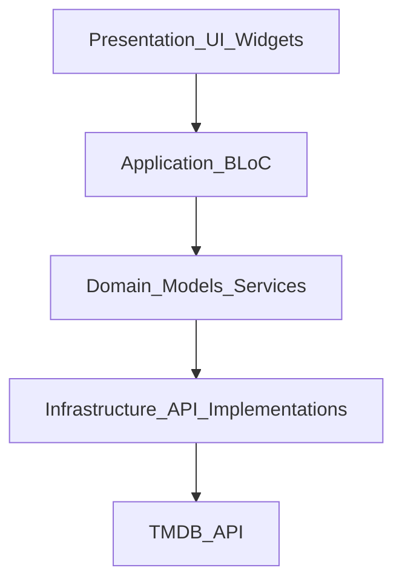
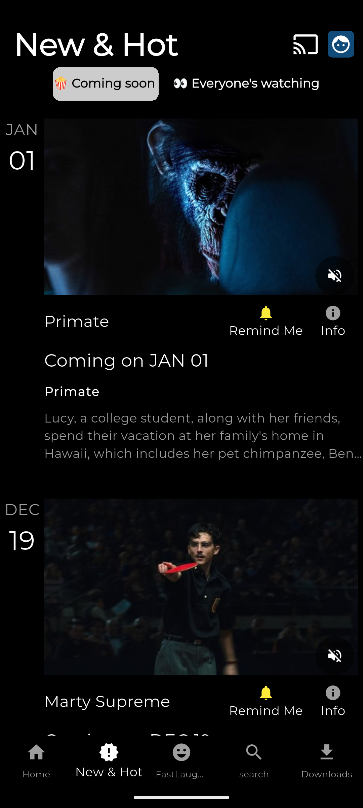
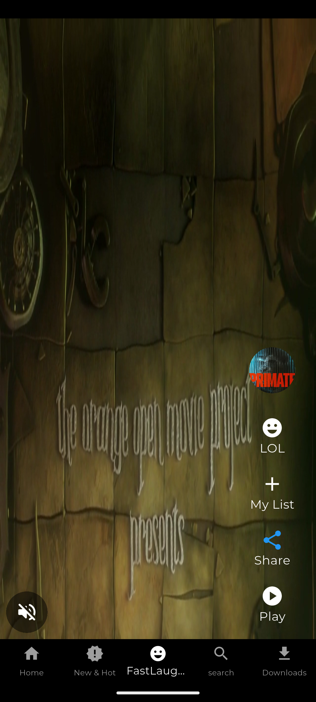
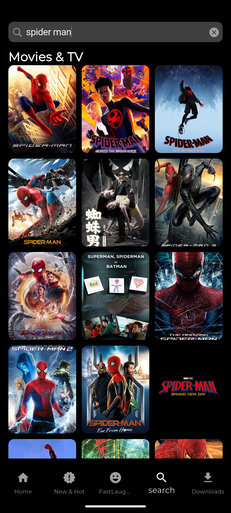
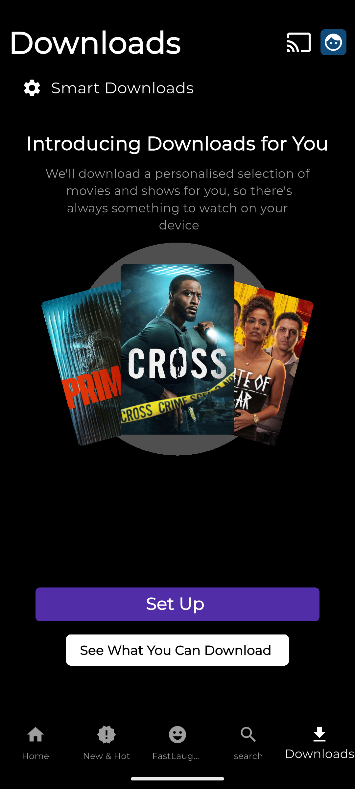

## Netflix Clone – Flutter

Beautiful Netflix-style Flutter application that showcases real movie and TV data from TMDB, with multiple screens, tabs, and a dark Netflix-inspired UI.

---

### Features

- **Home**
  - Hero banner with featured content.
  - Horizontal carousels such as **Released in Past Year**, **Trending Now**, **Top 10 TV Shows in India Today**, **Tense Dramas**, and **South Indian Cinema**.
  - Scroll-aware app bar that hides on scroll down and reappears on scroll up.

- **New & Hot**
  - Two tabs: **Coming Soon** and **Everyone’s Watching**.
  - Uses TMDB upcoming and trending/now playing endpoints.
  - Movie/TV cards with backdrop image, title, description, release date, and action buttons like **Remind Me** and **Info**.
  - Pull-to-refresh support on both tabs.

- **Fast Laughs**
  - Vertical, TikTok/Reels-style feed of short clips.
  - Uses sample video URLs for playback while leveraging TMDB posters and metadata.
  - Quick actions: **LOL/Like**, **My List**, **Share**, and **Play**, plus mute/unmute.

- **Search**
  - Cupertino-style search bar with debounced search requests.
  - Idle state shows **Top Searches** from trending content.
  - Search results list with posters and titles fetched from TMDB.

- **Downloads**
  - “Smart Downloads” style header (UI only).
  - “Introducing Downloads for You” section with a stacked-poster preview using TMDB images.
  - No real offline storage, but mimics the Netflix downloads experience.

- **Navigation & UX**
  - Bottom navigation bar: **Home**, **New & Hot**, **Fast Laughs**, **Search**, **Downloads**.
  - Consistent dark theme, Montserrat typography, and responsive layouts.

---

### Tech Stack

- **Framework**: Flutter (Dart)
- **State Management**: `flutter_bloc` + `freezed`
- **Networking**: `dio`
- **API**: TMDB (The Movie Database) REST API
- **Dependency Injection**: `get_it` + `injectable`
- **Data & Models**:
  - `dartz` for `Either`-based error handling.
  - `json_serializable` + `json_annotation` for JSON models.
- **UI & Utilities**:
  - `google_fonts` (Montserrat)
  - `video_player` for Fast Laughs videos
  - `share_plus` for sharing
  - `bordered_text` for “Top 10” number badges
  - `intl` for date formatting

---

### Architecture Overview

The project follows a layered architecture:

- **presentation/** – Widgets, screens, and UI-specific components.
- **application/** – BLoCs, events, and states (business logic, no Flutter widgets).
- **domain/** – Entities, value objects, and abstract service/repository interfaces.
- **infrastructure/** – Concrete implementations for TMDB services using `dio`, plus DTOs and mappers.

Dependency injection is handled with `injectable` and `get_it`, with generated configuration in `injectable.config.dart`.



---

### Prerequisites

- Flutter SDK installed (see `environment` in `pubspec.yaml` for supported Dart/Flutter versions).
- A TMDB account and an API key:
  - Create an account and generate an API key from the TMDB website.
- Basic Flutter tooling set up for your target platforms (Android/iOS/Web, etc.).

---

### TMDB API Configuration

This project uses the TMDB API for all movie and TV data.

1. **Create the API key file** (this file is intentionally ignored by git):
   - Path: `lib/infrastructure/key/api_key.dart`
   - Contents:

   ```dart
   const apiKey = 'YOUR_TMDB_API_KEY';
   ```

2. **Base URLs**:
   - API base URL and image base URL constants are defined in `lib/core/string.dart`.

> Make sure you do **not** commit your real TMDB API key to version control.

---

### Setup & Installation

From the `netflix_clone` directory:

1. **Install dependencies**

   ```bash
   flutter pub get
   ```

2. **Generate code (freezed, JSON models, injectable)**

   ```bash
   flutter pub run build_runner build --delete-conflicting-outputs
   ```

3. **Run the app**

   - For a connected device/emulator:

     ```bash
     flutter run
     ```

   - For web (if enabled):

     ```bash
     flutter run -d chrome
     ```

---

### Screenshots

Place your screenshots in `lib/screenshots/` and ensure the filenames below match your actual files.  
Example screenshot layout:

```markdown





```

---


This project is intended as a learning/demo app for Flutter, state management with BLoC, layered architecture, and consuming a real-world REST API with clean separation of concerns.
